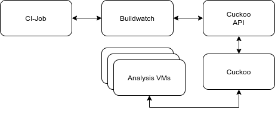

# Buildwatch

Watching your build. Buildwatch can make reports on what behaviour your build shows. To be honest you can not only watch
builds. Maybe you would rather watch your unit tests. No problem for buildwatch. The idea is that you host Buildwatch
somewhere on a standalone server and give it its tasks via a CI pipeline.

## SETUP
We quickly describe how to set up the project.



### CUCKOO
You need a running Cuckoo instance and a Cuckoo API.
You need to have [this fork](https://github.com/cybertier/Cuckoo) for the setup read its readme and the Cuckoo docs.
You need to run the daemon `cuckoo -d` and the API `cuckoo api`.
The IP and port of the API need to be given to Cuckoo via the configuration.

### ANALYSIS VM
```
cd buildwatch-vm-packer
./pack-vm
```

#### Grant that VM Internet access
```
sudo iptables -A FORWARD -o {yourinterfacehere} -i vboxnet0 -s 192.168.56.0/24 -m conntrack --ctstate NEW -j ACCEPT
sudo iptables -A FORWARD -m conntrack --ctstate ESTABLISHED,RELATED -j ACCEPT
sudo iptables -A POSTROUTING -t nat -j MASQUERADE
sudo sysctl -w net.ipv4.ip_forward=1
```

## CONFIGURE
The default configuration can be found in the [/config/default_config.py](config/default_config.py). If you
want to supply your own values and overwrite those provide a similar python file. The path to the file should be
supplied via the `BUILDWATCH_SETTINGS_FILE` environment variable. Buildwatch specific config options:

| Option name        | Default           | Description       |
| ------------- |:-------------| -----|
| SQLALCHEMY_DATABASE_URI | 'sqlite:///sql_lite.db'| The url pointing to the Database used. Can also point to other types of databases than sqlite. |
| SQLALCHEMY_TRACK_MODIFICATIONS | False | No need changing this |
| SECRETE_KEY | 'secret' | Used for cryptography should be changed in production |
| PROJECT_STORAGE_DIRECTORY | './storage' | Folder where data Buildwatch persistent data is stored |
| REPORT_FOR_FIRST_RUN | TRUE | Generate a report for the first run. Might perform badly on big projects. |
| DEBUG | True| Should be false in production |
| AUTH_TOKEN | 'filloutinprod'| Token used to authorize to the Buildwatch rest api |
| Cuckoo_API_URL | 'http://localhost:8090'| The url used to communicate with the Cuckoo rest api |
| Cuckoo_API_TOKEN | '5Ql0ClpOzM9oot53daAIvA' | The token for the Cuckoo api used to authenticate with it. Can be found in the configuration files of Cuckoo. (api_token property in Cuckoo.conf) |
| TIME_OUT_WAITING_FOR_Cuckoo | 3\*60\*60 | This many seconds we wait for Cuckoo builds to finish |
| TIME_OUT_WAITING_FOR_PREVIOUS_COMMIT | 3\*60\*60 | This many seconds we wait for the previous commit to be of status _prepared. |
| DELAY_CHECKING_Cuckoo_TASK_STATUS | 20| Every x seconds check if the Cuckoo task finished. |
| DELAY_CHECKING_PREVIOUS_TASK_STATUS | 20| Every x seconds check if the previous task finished. |
| PORT | 8080| Port Buildwatch rest api is started on |
| CUSTOM_WHITELIST | './storage/whitelist.json' | Points to a file in json format that contains a list of strings that are used to define whitelisted observables. Observable is whitelisted if it is exactly the whitelisted value. Use * at start and end of the item as a wildcard.|

Other flask or sqlachemy specific options can be found in the corresponding documentation and can be set in this file as
well.

## START BUILDWATCH
`docker-compose up --build`

## HOW TO USE

### Using git

If you are using git you can just create a project pointing to the git repository and then trigger runs using the git commit hash.
Buildwatch will check out the commit and watch for its behavior.
You should use the .buildwatch.sh file in the root directory of your repo to define the process you want to have watched.
Using buildwatch's REST API you can create the run and ask for its result.

### Using zips

If you are using another VCS or don't have a git repo for other reasons you can also provide zips containing a .buildwatch.sh.

create a project
`curl -X POST -H "Content-Type: application/json" -d '{"name": "test", "git_managed": false, "Cuckoo_analysis_per_run": 3, "old_runs_considered": 3}' localhost:8080/project`

```
{
  "Cuckoo_analysis_per_run": 3,
  "git_managed": false,
  "git_url": null,
  "id": 1,
  "name": "test",
  "old_runs_considered": 3,
  "patternson_off": false
}
```
upload a file
`curl -i -X POST -H "Content-Type: multipart/form-data" -F "file=@sample.zip" localhost:8080/run/uploadZip`

execute the run using that file
`curl -X POST -H "Content-Type: application/json" -d '{"project_id": "1", "user_set_identifier": "test", "zip_filename": "edc3cef2-da60-489f-9ee8-2ebb5844a301.zip"}' localhost:8080/run`

### Additional setup before each analysis
If you need additional setup that needs to be run just before the analysis you may define this is a `.prebuild.sh` file.
Buildwatch will execute the script before the analysis and will not record changes made this way.

### Logging stdout
Add `exec >> "program.log" 2>&1 && tail "program.log"` as the first line in your `.buidlwatch.sh` script in order to log the output.
Buildwatch will fetch the program.log into the storage folder with the Cuckoo reports.
This will help debugging.
